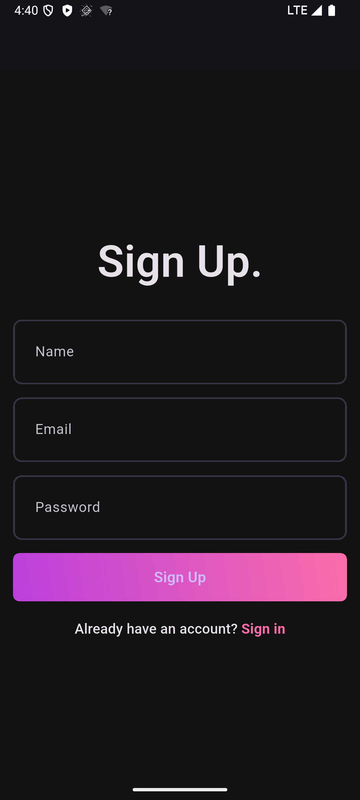
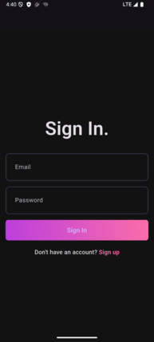

# Music App

# Music App

A Flutter-based music application designed to provide a seamless user experience for managing and playing music. This project emphasizes a clean architecture, robust state management, and efficient API integration.

## Features
- User Authentication (Signup & Login)
- Responsive User Interface
- Comprehensive State Management
- RESTful API Integration
- Music Playback Functionality
- Local Data Storage

## Technologies Used
- **Flutter**: Google's UI toolkit for building natively compiled applications for mobile, web, and desktop from a single codebase.
- **Dart**: The programming language used by Flutter.
- **fpdart**: A functional programming library for Dart, used for handling asynchronous operations and error management with `Either` types.
- **http**: A popular package for making HTTP requests to interact with RESTful APIs.
- **Riverpod**: A robust and flexible state management solution for Flutter, used here to implement the ViewModel pattern.
- **shared_preferences**: For lightweight local data storage.
- **dotted_border**: For creating customizable dotted borders.
- **flex_color_picker**: A versatile color picker widget.
- **file_picker**: For picking files from the device.
- **audio_waveforms**: For displaying audio waveforms.
- **just_audio**: A feature-rich audio player for Flutter.
- **hive**: A fast, lightweight, and powerful NoSQL database for Flutter applications.
- **isar_flutter_libs**: Isar database integration for Flutter.
- **path_provider**: For accessing commonly used locations on the filesystem.

## Architecture: MVVM (Model-View-ViewModel)

This project follows the MVVM architectural pattern to ensure a clear separation of concerns, testability, and maintainability.

- **Model**: Represents the data and business logic. This includes data models (e.g., `UserModel`) and repositories (e.g., `AuthRemoteRepository`, `AuthLocalRepository`) that handle data fetching, storage, and manipulation.

- **View**: The UI layer responsible for displaying information to the user and capturing user input. In Flutter, this corresponds to the widgets and screens. Views observe changes in the ViewModel and update themselves accordingly.

- **ViewModel**: Acts as an intermediary between the Model and the View. It exposes data streams and commands that the View can bind to. The ViewModel contains the presentation logic, transforms data from the Model into a format consumable by the View, and handles user interactions by delegating tasks to the Model. Riverpod is used to implement ViewModels, providing a reactive and efficient way to manage application state.

This separation allows for independent development of UI and business logic, making the codebase more modular and easier to scale.

## Screenshots

### Signup Page

### Login Page

## Getting Started
1. Clone the repository
2. Run `flutter pub get`
3. Start your backend server (update API URL if needed)
4. Run the app with `flutter run`

---

## Notes
- For Android emulator, use `10.0.2.2` as the backend host.
- Backend must be running for authentication features to work.

---

## License
MIT
